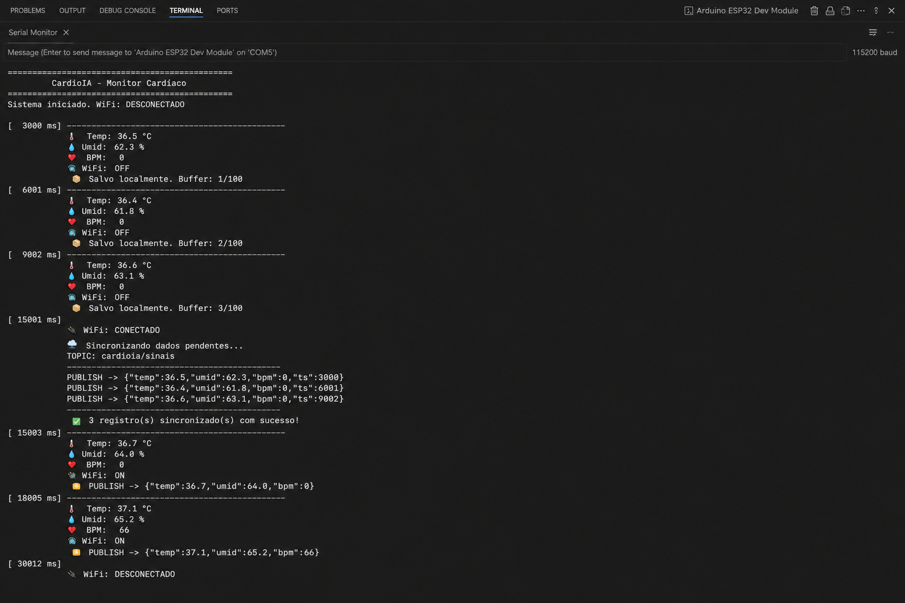
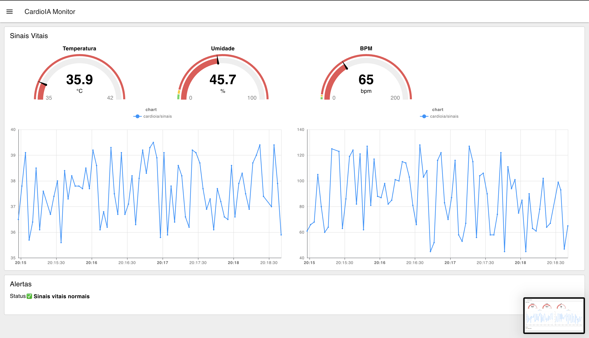
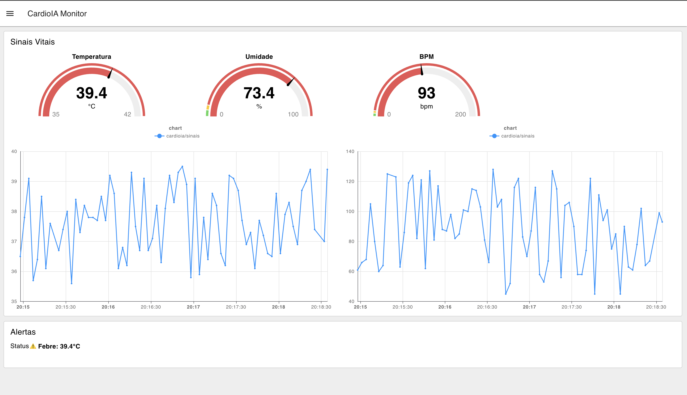

# FIAP - Faculdade de Informática e Administração Paulista

<p align="center">
<a href= "https://www.fiap.com.br/"></a>
</p>

<br>

# CardioIA - Inteligência Artificial Cardiovascular

## Nome do grupo

## 👨‍🎓 Integrantes:

- <a href="https://www.linkedin.com/in/anacornachi/">Ana Cornachi</a>
- <a href="https://www.linkedin.com/in/carlamaximo/">Carla Máximo</a>

## 👩‍🏫 Professores:

### Tutor(a)

- <a href="https://www.linkedin.com/in/lucas-gomes-moreira-15a8452a/">Lucas Gomes Moreira</a>

### Coordenador(a)

- <a href="https://www.linkedin.com/in/andregodoichiovato/">André Godoi Chiovato</a>

## 📁 Descrição do Projeto (Fase 3)

Esta fase implementa a camada de IoT do CardioIA, simulando um dispositivo vestível
de monitoramento cardíaco com ESP32, transmissão via MQTT e visualização em dashboard
em tempo real.

---

### Parte 1 – Armazenamento e Processamento Local (Edge Computing)

O sistema captura dois sinais vitais em tempo real:

- **DHT22 (GPIO 15):** temperatura (°C) e umidade relativa (%) — considerado 1 sensor
- **Botão de pressão (GPIO 18):** simula batimentos cardíacos (BPM) — o usuário pressiona
  X vezes por minuto e o sistema calcula o BPM em janelas de 10 segundos

#### Lógica de Resiliência Offline

A conectividade Wi-Fi é simulada por uma variável booleana que alterna a cada 15 segundos
entre conectado e desconectado, representando oscilações de rede reais.

- **Offline:** leituras armazenadas em buffer local (máx. 100 registros, estratégia FIFO)
- **Online:** dados sincronizados via `Serial.println` no formato JSON e buffer zerado
- **Capacidade:** 100 registros × 3s = ~5 minutos de dados sem conexão

> Pela limitação dos simuladores em executar SPIFFS, o Monitor Serial foi utilizado
> como alternativa de resiliência offline, conforme orientado pelo enunciado.

#### Alertas Clínicos

| Sinal       | Condição        | Limite    |
| ----------- | --------------- | --------- |
| Temperatura | Febre           | > 38°C    |
| BPM         | Taquicardia     | > 120 bpm |
| BPM         | Bradicardia     | < 40 bpm  |
| Umidade     | Umidade elevada | > 80%     |

**Monitor Serial — Resiliência Offline e Sincronização:**


#### Entregáveis

- Código C++ comentado: `src/iot/src/main.cpp`
- Relatório:
  - `document/relatorio_fase3_parte1.pdf`
  - `document/relatorio_fase3_parte1.md`

---

### Parte 2 – Transmissão para Nuvem e Visualização (Fog/Cloud Computing)

#### Arquitetura

ESP32 (Python publisher) → HiveMQ Cloud (MQTT broker) → Node-RED (dashboard)

- **Broker:** HiveMQ Cloud com TLS (porta 8883)
- **Tópico:** `cardioia/sinais`
- **Payload:** `{"temp": 38.2, "umid": 65.3, "bpm": 95, "ts": 1715456789}`
- **Dashboard:** Node-RED com @flowfuse/node-red-dashboard

#### Dashboard

- 3 gauges: Temperatura, Umidade e BPM
- 2 gráficos de linha: Temperatura e BPM ao longo do tempo
- Indicador de alertas automáticos em tempo real

**Sinais Vitais Normais:**


**Alerta de Febre:**


#### Entregáveis

- Publisher Python: `src/mqtt/publisher.py`
- Flow Node-RED: `src/mqtt/nodered_flow.json`
- Relatório (7 páginas, com imagens de evidência):
  - `document/relatorio_fase3_parte2.pdf`
  - `document/relatorio_fase3_parte2.md`

---

## 🔧 Como executar o código (Fase 3)

### Parte 1 — Simulação ESP32

1. Instala o PlatformIO no VSCode
2. Abre a pasta `src/iot/`
3. Compila:

```bash
    pio run
```

4. Inicia o simulador Wokwi: `F1` → **Wokwi: Start Simulator**

### Parte 2 — Publisher MQTT

1. **Pré-requisitos:**

```bash
    pip install paho-mqtt
```

2. **Execução:**

```bash
    python3 src/mqtt/publisher.py
```

3. **Dashboard:** acessa `http://localhost:1880/dashboard` com Node-RED rodando

### Parte 2 — Node-RED

1. Instala o Node-RED:

```bash
    npm install -g node-red
```

2. Instala o dashboard:

```bash
    cd ~/.node-red
    npm install @flowfuse/node-red-dashboard
```

3. Inicia:

```bash
    node-red
```

4. Importa o flow: `src/mqtt/nodered_flow.json`
5. Clica **Deploy** e acessa `http://localhost:1880/dashboard`

## 🗃 Histórico de lançamentos

- 0.2.0 - 12/05/2026
  - Fase 3 - Parte 1: Adiciona relatório detalhado com evidências de testes offline e online, incluindo screenshots do Monitor Serial e análise de resiliência.
  * Atualiza README com instruções de execução e evidências visuais.
- 0.1.0 - 11/05/2026
  - Fase 3 - Parte 1: Código ESP32 com DHT22 e botão BPM, lógica de resiliência
    offline com buffer FIFO de 100 registros e alertas clínicos automáticos.
  - Fase 3 - Parte 2: Dashboard Node-RED com gauges, gráficos e alertas automáticos
    via MQTT. Publisher Python simulando ESP32 publicando no HiveMQ Cloud.

## 📋 Licença

<p xmlns:cc="http://creativecommons.org/ns#" xmlns:dct="http://purl.org/dc/terms/"><a property="dct:title" rel="cc:attributionURL" href="https://github.com/agodoi/template">MODELO GIT FIAP</a> por <a rel="cc:attributionURL dct:creator" property="cc:attributionName" href="https://fiap.com.br">Fiap</a> está licenciado sobre <a href="http://creativecommons.org/licenses/by/4.0/?ref=chooser-v1" target="_blank" rel="license noopener noreferrer" style="display:inline-block;">Attribution 4.0 International</a>.</p>
